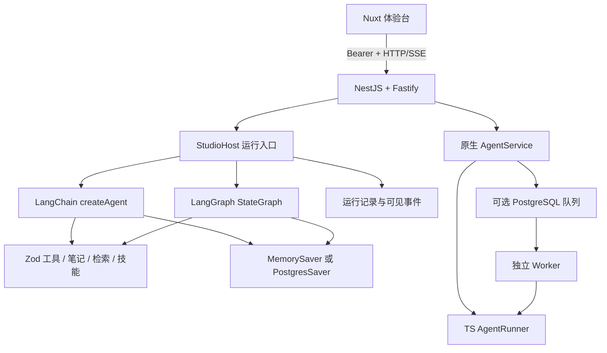
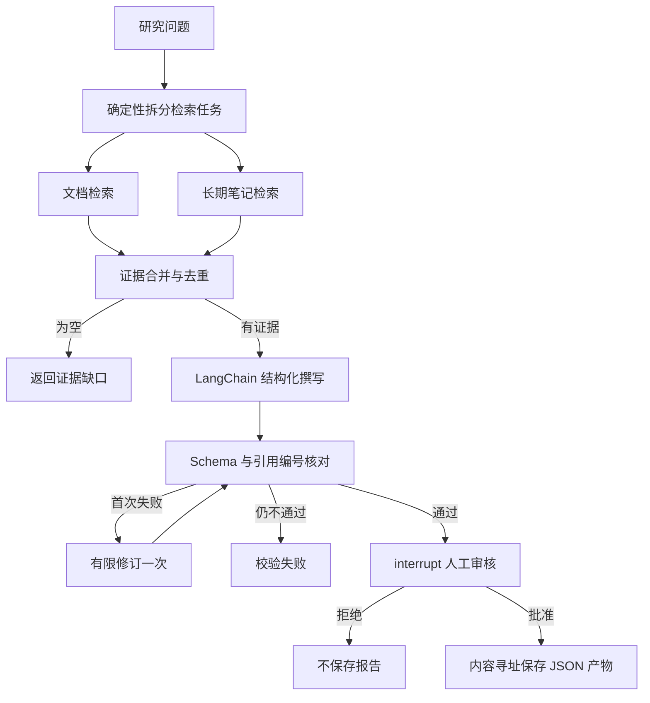

# 架构与流程

## 两种执行器，不叠加三套循环

框架主线用 LangChain 管理模型/工具循环，用 LangGraph 管理研究流程。原生 TS 核心用于原理教学、已有 CLI 与 Worker。它们共享计算器、文档检索、技能目录和笔记服务，**不共享运行状态机**。

`integrations/langchain/model.ts` 将规则演示模型与真实模型都实现为框架模型接口。演示替身不绕过 LangChain 工具循环或 LangGraph 节点；只替换概率生成部分。核心零依赖入口则明确标为原生教学台。

## 研究流程

检索计划是确定性代码，不包装为 AI 自主规划。引用编号验证只证明引用存在于本次证据集合，不证明断言语义被证据充分支持。人工审核不能被自动评测完全替代。

## 状态与持久化

| 层 | 数据 | 默认位置 | 重启表现 |
|---|---|---|---|
| 模型工作上下文 | 完整最近轮次 | 模型调用参数 | 每次重新构建 |
| 图执行状态 | messages、节点、interrupt | MemorySaver | 默认重启丢失 |
| 图持久检查点 | 同上 | PostgreSQL，可选 | 可恢复，需相同 thread_id |
| Studio 记录 | prompt、事件、最终输出 | `.data/studio` 租户目录 | 保留但不代替检查点 |
| 长期笔记 | 明确批准的用户事实 | `.data/notes` | 可跨会话读取 |
| 报告文件 | 已批准结构化报告 | `.data/reports` | 内容寻址幂等 |
| 原生执行记录 | RunState | file/memory/postgres | 依存储而定 |

## 线程与运行

一次用户提交对应 `runId`；同一普通 Agent 的连续对话复用 `threadId`。研究任务默认新线程。身份来自服务端 `LOCAL_TENANT_ID`；路由拒绝跨租户运行。原始历史保存在检查点，`selectContext` 只裁剪传给模型的消息副本。

Studio 同一线程只允许一个活动执行。当前锁为进程内集合，**不支持多副本并发所有权**。生产化应增加数据库租约和 fencing token；不要仅增加副本数就认定具备分布式执行保证。

## 中断与副作用

LangGraph 节点在恢复时可能从头执行，因此 `approval` 节点中断前不写报告。`export` 节点按内容哈希去重。笔记按内容寻址，审批绑定当前框架 checkpoint 的实际调用。新增发送邮件、付款等不可幂等动作之前，必须补业务幂等键、外部结果核对和持久执行所有权。

原生执行器已有 `reconciliation_required`，只适用于原生状态；不能推定框架执行器拥有完全相同的结果核对协议。

## 参考

[LangChain 概览](https://docs.langchain.com/oss/javascript/langchain/overview) · [LangGraph 概览](https://docs.langchain.com/oss/javascript/langgraph/overview) · [中断](https://docs.langchain.com/oss/javascript/langgraph/interrupts) · [持久化](https://docs.langchain.com/oss/javascript/langgraph/persistence)
